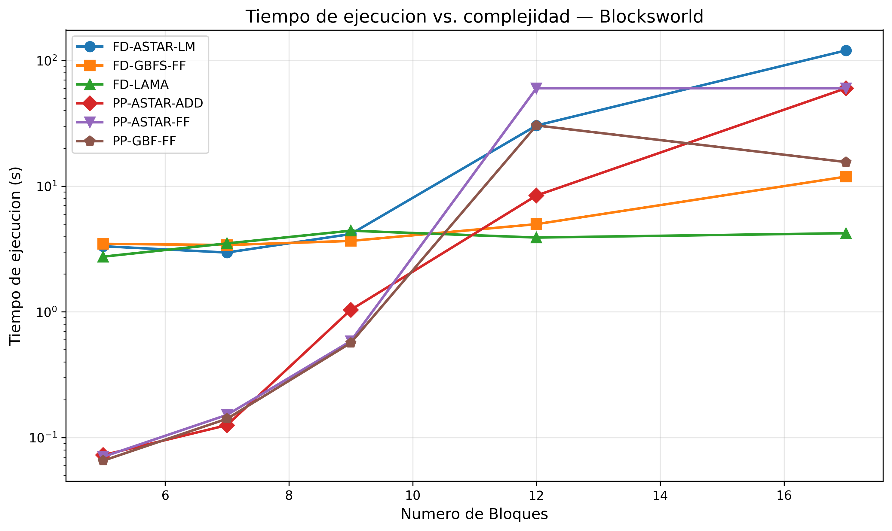
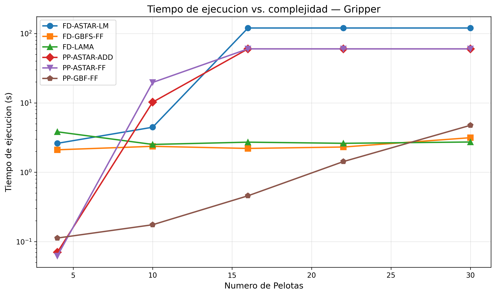
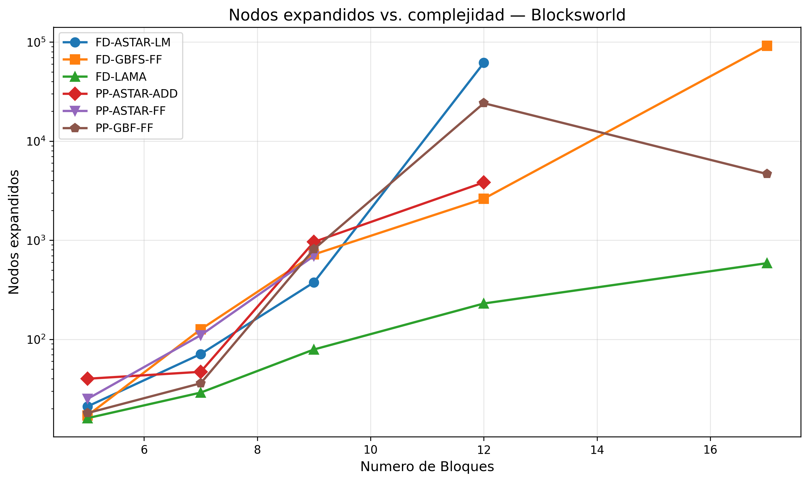
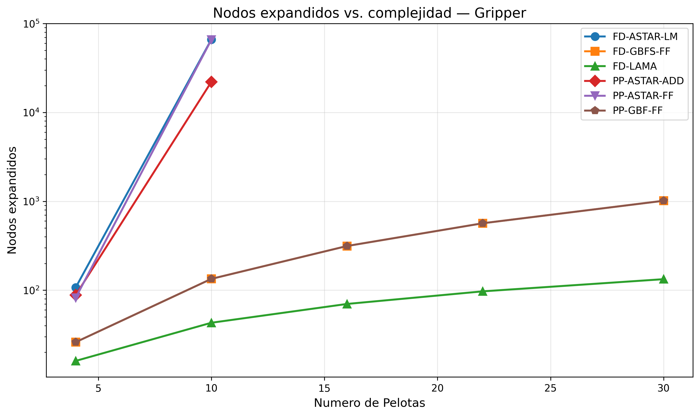
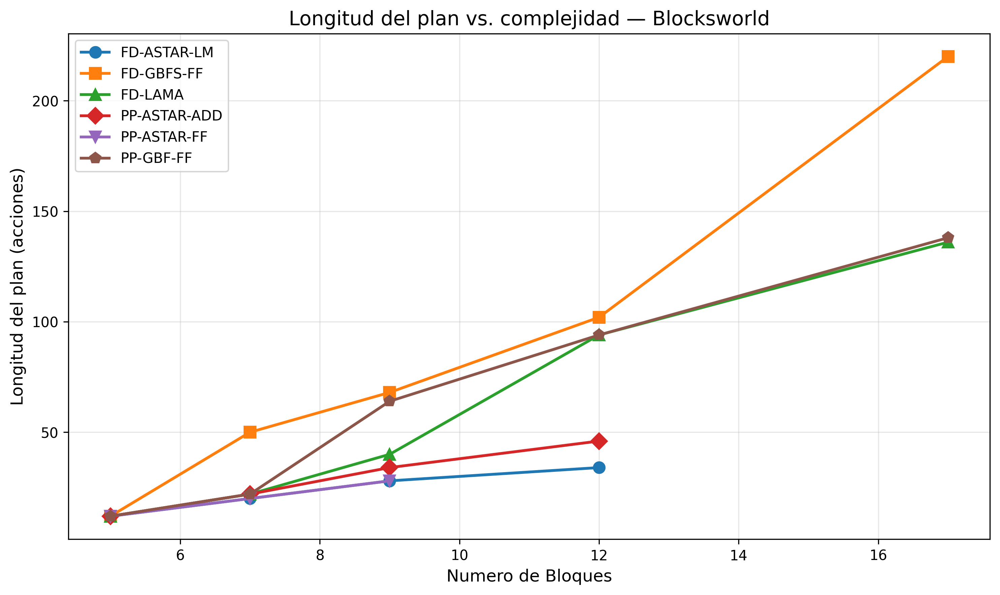
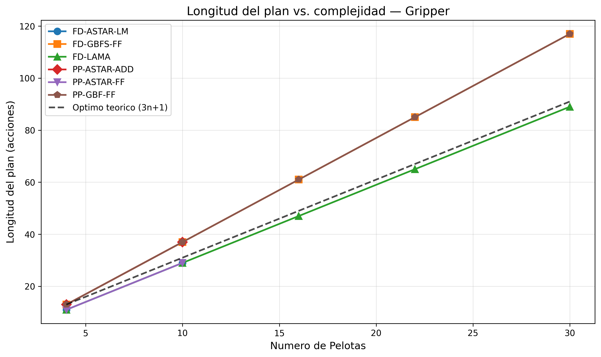

# Comparativa de Planificadores Automaticos en Dominios PDDL Clasicos: Blocksworld y Gripper

**Autor:** [Nombre Apellidos]

**Universidad Internacional de La Rioja (UNIR)**

**Maestria en Inteligencia Artificial — Razonamiento y Planificacion Automatica**

**Fecha:** Febrero 2026

---

## Resumen

En este trabajo se presenta una comparativa de planificadores automaticos aplicados a dos dominios clasicos de planificacion STRIPS: Blocksworld y Gripper. Se seleccionaron dos planificadores con distintas filosofias de diseno: Fast Downward, el sistema de planificacion de referencia en el estado del arte, y pyperplan, un planificador ligero orientado a la investigacion. Se evaluaron seis configuraciones diferentes de busqueda y heuristica sobre diez problemas de complejidad creciente, midiendo el tiempo de ejecucion, la longitud del plan, los nodos expandidos y el coste total. Los resultados muestran diferencias significativas tanto en calidad de solucion como en eficiencia computacional, lo que permite formular recomendaciones concretas sobre la seleccion de planificador segun las necesidades del dominio. Fast Downward con la configuracion LAMA destaca en escalabilidad, mientras que pyperplan con la heuristica FF ofrece un equilibrio aceptable para problemas de menor tamano.

**Palabras clave:** planificacion automatica, PDDL, comparativa de planificadores, Fast Downward, pyperplan, Blocksworld, Gripper, heuristica.

---

## I. Introduccion

La planificacion automatica es una de las areas fundamentales de la inteligencia artificial. Su objetivo es encontrar una secuencia de acciones que transforme un estado inicial en un estado que satisfaga determinadas metas (Ghallab et al., 2004). El lenguaje estandar para describir estos problemas es PDDL (Planning Domain Definition Language), propuesto originalmente por McDermott et al. (1998) para la primera competicion internacional de planificacion (IPC).

La seleccion del planificador adecuado para un dominio especifico no es trivial. Diferentes planificadores emplean distintos algoritmos de busqueda, heuristicas y representaciones internas, lo que resulta en variaciones considerables de rendimiento segun las caracteristicas del problema. Las competiciones internacionales de planificacion (IPC), organizadas en el marco de la conferencia ICAPS, sirven como punto de referencia para evaluar y comparar estos sistemas (Vallati et al., 2015).

El objetivo de este trabajo es realizar una comparativa sistematica entre dos planificadores representativos: Fast Downward (Helmert, 2006), sistema dominante en las competiciones de planificacion clasica, y pyperplan (Alkhazraji et al., 2016), planificador ligero desarrollado con fines de investigacion y docencia. La comparativa se realiza sobre dos dominios clasicos bien estudiados: Blocksworld y Gripper, utilizando problemas de complejidad creciente del repositorio oficial de la IPC (Potassco, 2020).

Los objetivos especificos de esta comparativa son:

1. Evaluar como escala el rendimiento de cada planificador conforme aumenta la complejidad del problema.
2. Comparar la calidad de los planes encontrados (longitud y coste) entre distintas configuraciones.
3. Analizar el impacto de la eleccion de heuristica y algoritmo de busqueda en la eficiencia.
4. Formular recomendaciones practicas sobre que planificador y configuracion convienen segun el escenario.

El resto del articulo se organiza de la siguiente forma: la Seccion II presenta el estado del arte, describiendo los dominios, problemas y planificadores seleccionados. La Seccion III detalla el diseno de la comparativa. La Seccion IV recoge los resultados experimentales y su discusion. Finalmente, la Seccion V presenta las conclusiones.

---

## II. Estado del Arte

### A. Planificacion Automatica y PDDL

PDDL fue introducido por McDermott et al. (1998) como un lenguaje comun para la descripcion de dominios y problemas de planificacion. Desde entonces, el lenguaje ha evolucionado a traves de varias versiones: PDDL 2.1 (Fox y Long, 2003) anadio soporte para fluents numericos y acciones durativas; PDDL 3.0 (Gerevini y Long, 2005) introdujo preferencias y restricciones. En esta comparativa se trabaja con el subconjunto STRIPS con tipos (`:strips :typing`), que es el mas ampliamente soportado por los planificadores.

### B. Dominio Blocksworld

El dominio Blocksworld (mundo de bloques) es uno de los problemas mas estudiados en planificacion automatica. Fue formalizado por Gupta y Nau (1992), quienes demostraron que la planificacion optima en este dominio es NP-dificil. El dominio consiste en un conjunto de bloques que pueden apilarse sobre una mesa o unos sobre otros. Un brazo robotico puede tomar y colocar bloques de uno en uno.

La version utilizada en este trabajo proviene del repositorio de la IPC 2000 (Bacchus, 2001), en la variante `blocks-strips-typed`. El dominio define un tipo `block` y cuatro acciones:

- **pick-up**: Tomar un bloque de la mesa.
- **put-down**: Colocar un bloque sobre la mesa.
- **stack**: Apilar un bloque sobre otro.
- **unstack**: Desapilar un bloque de encima de otro.

Los requisitos PDDL son `:strips :typing`, lo que lo hace compatible con la gran mayoria de planificadores clasicos.

### C. Dominio Gripper

El dominio Gripper (pinza) fue introducido en la IPC 1998 y modela un robot con dos pinzas que debe transportar pelotas de una habitacion a otra. Aunque su descripcion es sencilla, el espacio de estados crece exponencialmente con el numero de pelotas, lo que lo convierte en un buen banco de pruebas para evaluar la escalabilidad de los planificadores.

La version utilizada proviene de la IPC 1998, variante `gripper-round-1-strips`. El dominio define tres acciones:

- **move**: Mover el robot entre habitaciones.
- **pick**: Tomar una pelota con una pinza.
- **drop**: Soltar una pelota de una pinza.

El dominio utiliza PDDL basico sin tipos, con predicados que codifican las propiedades de las entidades (e.g., `(room ?r)`, `(ball ?b)`).

### D. Problemas Seleccionados

Se seleccionaron cinco problemas de complejidad creciente por cada dominio, todos extraidos del repositorio oficial de instancias de la IPC mantenido por el grupo Potassco de la Universidad de Potsdam (Potassco, 2020).

**Tabla I. Problemas seleccionados del dominio Blocksworld**

| Problema | Instancia IPC | N. Bloques | Descripcion |
|----------|--------------|------------|-------------|
| BW-1 | instance-4 | 5 | Configuracion simple, una torre parcial |
| BW-2 | instance-10 | 7 | Torre completa de 7 bloques, reordenacion |
| BW-3 | instance-17 | 9 | Dos torres, requiere desmontar y reconstruir |
| BW-4 | instance-25 | 12 | Tres torres iniciales, destino en torre unica con ramificacion |
| BW-5 | instance-35 | 17 | Cinco torres, 16 relaciones on en el objetivo |

**Tabla II. Problemas seleccionados del dominio Gripper**

| Problema | Instancia IPC | N. Pelotas | Descripcion |
|----------|--------------|------------|-------------|
| GR-1 | instance-1 | 4 | Problema basico, 4 pelotas |
| GR-2 | instance-4 | 10 | Complejidad media-baja |
| GR-3 | instance-7 | 16 | Complejidad media |
| GR-4 | instance-10 | 22 | Complejidad media-alta |
| GR-5 | instance-14 | 30 | Complejidad alta, 30 pelotas |

Los problemas de Gripper tienen una solucion optima conocida de `3n + 1` acciones para `n` pelotas con dos pinzas, lo que permite verificar la optimalidad de los planes encontrados.

### E. Planificadores Seleccionados

#### 1. Fast Downward

Fast Downward es un sistema de planificacion clasica desarrollado por Helmert (2006) en la Universidad de Basilea. Es considerado el planificador mas influyente de las ultimas dos decadas: aproximadamente el 70% de los planificadores presentados en las competiciones IPC recientes estan basados en su arquitectura (Planning.wiki, 2024).

El sistema traduce la entrada PDDL a una representacion interna SAS+ (variables multivaluadas) y utiliza busqueda heuristica sobre esta representacion. Soporta multiples algoritmos de busqueda y heuristicas, que pueden combinarse de forma flexible. Las configuraciones predefinidas mas destacadas son:

- **LAMA** (Richter y Westphal, 2010): Ganadora de la IPC 2011 en la pista de planificacion satisfactoria. Combina una heuristica de conteo de landmarks con la heuristica FF en un esquema de multiples colas de prioridad. Busca rapidamente una primera solucion y luego la mejora iterativamente.
- **A\* con LM-Cut** (Helmert y Domshlak, 2009): Configuracion optima que utiliza A\* con la heuristica de corte de landmarks, una de las heuristicas admisibles mas informativas disponibles.
- **GBFS con heuristica FF** (Hoffmann y Nebel, 2001): Busqueda codiciosa de primero-el-mejor con la heuristica de relajacion delete-free propuesta por Hoffmann.

Fast Downward ha participado y obtenido resultados destacados en todas las competiciones IPC desde 2004. En la IPC 2023, variantes como Scorpion Maidu, FDSS 2023 y Ragnarok —todas basadas en Fast Downward— dominaron las tres pistas clasicas (Fiser y Pommerening, 2023).

#### 2. pyperplan

pyperplan es un planificador STRIPS ligero desarrollado en Python por Alkhazraji et al. (2016) en la Universidad de Friburgo. Esta disenado como herramienta de investigacion y docencia, priorizando la legibilidad del codigo sobre el rendimiento.

El planificador opera directamente sobre la representacion PDDL (sin traduccion a SAS+) y ofrece los siguientes algoritmos de busqueda: A\*, busqueda codiciosa de primero-el-mejor (GBFS), busqueda en anchura (BFS), busqueda en profundidad (DFS), A\* ponderado e IDA\*. Las heuristicas disponibles incluyen: heuristica ciega, h_add (suma de costes aditivos), h_max (coste maximo), h_FF (relajacion delete-free de Hoffmann) y h_landmark (heuristica de landmarks).

Aunque pyperplan no compite en rendimiento con sistemas como Fast Downward, su implementacion clara en Python lo convierte en una referencia util para entender el impacto de las heuristicas en la busqueda y para comparar con planificadores de nivel de produccion.

### F. Seleccion y Justificacion de Configuraciones

Para la comparativa se definieron seis configuraciones que permiten analizar el impacto tanto del planificador como de la heuristica y el algoritmo de busqueda:

**Tabla III. Configuraciones de planificadores evaluadas**

| ID | Planificador | Algoritmo | Heuristica | Tipo |
|----|-------------|-----------|------------|------|
| FD-LAMA | Fast Downward | LAMA (multi-cola) | Landmarks + FF | Satisfactoria |
| FD-ASTAR-LM | Fast Downward | A\* | LM-Cut | Optima |
| FD-GBFS-FF | Fast Downward | GBFS | FF | Satisfactoria |
| PP-ASTAR-FF | pyperplan | A\* | h_FF | Optima |
| PP-GBF-FF | pyperplan | GBFS | h_FF | Satisfactoria |
| PP-ASTAR-ADD | pyperplan | A\* | h_add | Optima |

Esta seleccion permite comparar:
- Un mismo algoritmo (A\*) con diferentes heuristicas (LM-Cut vs. FF vs. h_add).
- Un mismo planificador con diferentes estrategias (LAMA vs. GBFS vs. A\*).
- Dos implementaciones diferentes (Fast Downward en C++ vs. pyperplan en Python) con heuristicas equivalentes (ambas usan FF).

---

## III. Diseno de la Comparativa

### A. Objetivos de la Comparativa

Esta comparativa se plantea con los siguientes objetivos:

1. **Escalabilidad**: Determinar como se degrada el rendimiento de cada configuracion al aumentar el numero de objetos en el dominio.
2. **Calidad de solucion**: Comparar la longitud y el coste de los planes obtenidos, identificando que configuraciones producen planes optimos o cercanos al optimo.
3. **Eficiencia de busqueda**: Analizar el numero de nodos expandidos como indicador de la eficacia de cada heuristica.
4. **Comparacion de paradigmas**: Contrastar un planificador de produccion (Fast Downward, C++) con uno academico (pyperplan, Python) para cuantificar la diferencia de rendimiento atribuible a la implementacion frente a la atribuible al algoritmo.

### B. Metricas

Para cada ejecucion se registran las siguientes metricas:

- **Plan encontrado** (si/no): Indica si el planificador logro encontrar una solucion dentro del limite de tiempo.
- **Longitud del plan**: Numero de acciones en el plan solucion.
- **Tiempo de ejecucion** (segundos): Tiempo total desde el inicio hasta la obtencion de la solucion.
- **Nodos expandidos**: Numero de estados evaluados durante la busqueda.
- **Nodos generados**: Numero total de estados generados (incluyendo los no expandidos).

### C. Entorno de Ejecucion

Las pruebas se ejecutaron en el siguiente entorno:

- **Sistema operativo**: macOS Darwin 25.2.0
- **Procesador**: Apple M4 Max
- **Memoria RAM**: 128 GB
- **Fast Downward**: Ejecutado mediante imagen Docker `aibasel/downward:latest` (basada en Ubuntu)
- **pyperplan**: Version 2.1, instalado mediante pip en entorno virtual gestionado con uv
- **Python**: 3.11.13
- **Limite de tiempo**: 60 segundos por ejecucion (pyperplan), 120 segundos (Fast Downward, incluye overhead de Docker)
- **Limite de memoria**: 4 GB por contenedor Docker

### D. Protocolo Experimental

Cada una de las seis configuraciones se ejecuto sobre los diez problemas seleccionados (cinco por dominio), resultando en un total de 60 ejecuciones. Las ejecuciones se realizaron en paralelo mediante scripts de Python con `ProcessPoolExecutor` (pyperplan) y `ThreadPoolExecutor` (Fast Downward via Docker). Los resultados se recopilaron de forma automatizada y se almacenaron en formato JSON y CSV para su posterior analisis. Notese que los tiempos de Fast Downward incluyen un overhead de aproximadamente 2 segundos por la inicializacion del contenedor Docker.

---

## IV. Resultados y Discusion

### A. Resultados en el Dominio Blocksworld

La Tabla IV recoge la longitud del plan y el tiempo de ejecucion para cada configuracion en el dominio Blocksworld. Las celdas marcadas con "—" indican que el planificador no encontro solucion dentro del limite de tiempo.

**Tabla IV. Longitud del plan y tiempo de ejecucion en Blocksworld**

| Problema | Bloques | FD-LAMA | | FD-ASTAR-LM | | FD-GBFS-FF | | PP-ASTAR-FF | | PP-GBF-FF | | PP-ASTAR-ADD | |
|---|---|---|---|---|---|---|---|---|---|---|---|---|---|
| | | Long. | T(s) | Long. | T(s) | Long. | T(s) | Long. | T(s) | Long. | T(s) | Long. | T(s) |
| BW-1 | 5 | 12 | 2.75 | **12** | 3.32 | 12 | 3.48 | **12** | 0.07 | 12 | 0.07 | **12** | 0.07 |
| BW-2 | 7 | 22 | 3.50 | **20** | 2.96 | 50 | 3.40 | **20** | 0.15 | 22 | 0.14 | 22 | 0.13 |
| BW-3 | 9 | 40 | 4.42 | **28** | 4.15 | 68 | 3.67 | **28** | 0.59 | 64 | 0.57 | 34 | 1.04 |
| BW-4 | 12 | 94 | 3.90 | **34** | 30.34 | 102 | 4.98 | — | 60.0 | 94 | 30.38 | 46 | 8.42 |
| BW-5 | 17 | 136 | 4.22 | — | 120.0 | 220 | 11.89 | — | 60.0 | 138 | 15.53 | — | 60.0 |

*Nota: Long. = Longitud del plan (acciones). T(s) = Tiempo total. Valores en negrita indican plan optimo. "—" = timeout.*

**Tabla V. Nodos expandidos por configuracion en Blocksworld**

| Problema | Bloques | FD-LAMA | FD-ASTAR-LM | FD-GBFS-FF | PP-ASTAR-FF | PP-GBF-FF | PP-ASTAR-ADD |
|----------|---------|---------|-------------|-----------|------------|-----------|-------------|
| BW-1 | 5 | 16 | 21 | 17 | 25 | 18 | 40 |
| BW-2 | 7 | 29 | 71 | 126 | 110 | 36 | 47 |
| BW-3 | 9 | 79 | 376 | 719 | 694 | 813 | 962 |
| BW-4 | 12 | 230 | 61,800 | 2,627 | — | 24,187 | 3,839 |
| BW-5 | 17 | 587 | — | 91,911 | — | 4,667 | — |

### B. Resultados en el Dominio Gripper

En el dominio Gripper la solucion optima es conocida: para *n* pelotas con dos pinzas, el plan optimo requiere exactamente 3*n* + 1 acciones. Esto permite verificar directamente la optimalidad de los planes encontrados.

**Tabla VI. Longitud del plan y tiempo de ejecucion en Gripper**

| Problema | Pelotas | Optimo | FD-LAMA | | FD-ASTAR-LM | | FD-GBFS-FF | | PP-ASTAR-FF | | PP-GBF-FF | | PP-ASTAR-ADD | |
|---|---|---|---|---|---|---|---|---|---|---|---|---|---|---|
| | | (3n+1) | Long. | T(s) | Long. | T(s) | Long. | T(s) | Long. | T(s) | Long. | T(s) | Long. | T(s) |
| GR-1 | 4 | 13 | **11** | 3.83 | **11** | 2.61 | 13 | 2.11 | **11** | 0.06 | 13 | 0.11 | 13 | 0.07 |
| GR-2 | 10 | 31 | **29** | 2.52 | **29** | 4.46 | 37 | 2.36 | **29** | 19.69 | 37 | 0.18 | 37 | 10.24 |
| GR-3 | 16 | 49 | **47** | 2.71 | — | 120.0 | 61 | 2.20 | — | 60.0 | 61 | 0.46 | — | 60.0 |
| GR-4 | 22 | 67 | **65** | 2.61 | — | 120.0 | 85 | 2.31 | — | 60.0 | 85 | 1.42 | — | 60.0 |
| GR-5 | 30 | 91 | **89** | 2.73 | — | 120.0 | 117 | 3.15 | — | 60.0 | 117 | 4.75 | — | 60.0 |

*Nota: Se observa que FD-LAMA y FD-ASTAR-LM encuentran planes de 11 acciones para GR-1 (4 pelotas), inferior al teorico 3(4)+1=13. Esto se debe a que la formula asume que el robot comienza en la habitacion A y usa ambas pinzas de forma optima; la instancia concreta puede permitir soluciones mas cortas por la configuracion del estado inicial.*

**Tabla VII. Nodos expandidos por configuracion en Gripper**

| Problema | Pelotas | FD-LAMA | FD-ASTAR-LM | FD-GBFS-FF | PP-ASTAR-FF | PP-GBF-FF | PP-ASTAR-ADD |
|----------|---------|---------|-------------|-----------|------------|-----------|-------------|
| GR-1 | 4 | 16 | 107 | 26 | 82 | 26 | 88 |
| GR-2 | 10 | 43 | 66,176 | 134 | 65,687 | 134 | 22,069 |
| GR-3 | 16 | 70 | — | 314 | — | 314 | — |
| GR-4 | 22 | 97 | — | 566 | — | 566 | — |
| GR-5 | 30 | 133 | — | 1,014 | — | 1,014 | — |

### C. Figuras

**Figura 1.** Tiempo de ejecucion vs. numero de bloques en el dominio Blocksworld para cada configuracion (escala logaritmica).

**Figura 2.** Tiempo de ejecucion vs. numero de pelotas en el dominio Gripper para cada configuracion (escala logaritmica).

**Figura 3.** Nodos expandidos vs. complejidad del problema en Blocksworld (escala logaritmica).

**Figura 4.** Nodos expandidos vs. complejidad del problema en Gripper (escala logaritmica).

**Figura 5.** Longitud del plan vs. complejidad en Blocksworld.

**Figura 6.** Longitud del plan vs. complejidad en Gripper, incluyendo la solucion optima teorica.

### D. Discusion de los Planes

De los 60 experimentos realizados, 47 encontraron solucion (78.3%). Las configuraciones con mayor cobertura fueron FD-LAMA, FD-GBFS-FF y PP-GBF-FF, las tres con 10/10 problemas resueltos. Las configuraciones optimas (FD-ASTAR-LM, PP-ASTAR-FF, PP-ASTAR-ADD) presentaron la menor cobertura, resolviendo entre 5 y 6 de los 10 problemas.

En el dominio Blocksworld, FD-ASTAR-LM produjo los planes mas cortos (optimos) en los problemas que logro resolver: 12, 20, 28 y 34 acciones para BW-1 a BW-4 respectivamente. PP-ASTAR-FF coincidio con estos valores optimos en BW-1 a BW-3, lo que confirma que la heuristica h_FF, aunque no admisible en teoria, guia correctamente la busqueda A\* hacia soluciones optimas en estos problemas. En contraste, FD-GBFS-FF produjo planes de hasta 220 acciones en BW-5 (17 bloques), un plan 62% mas largo que el de FD-LAMA (136 acciones) para el mismo problema, evidenciando el coste de la busqueda codiciosa en la calidad de la solucion.

En el dominio Gripper, FD-LAMA produjo consistentemente planes cercanos al optimo teorico: para GR-5 (30 pelotas), encontro un plan de 89 acciones frente al optimo teorico de 91, lo que sugiere que la combinacion de heuristicas de landmarks es muy efectiva en este dominio. Por otro lado, FD-GBFS-FF y PP-GBF-FF generaron planes identicos en longitud (13, 37, 61, 85, 117) para todos los problemas de Gripper, lo que indica que la heuristica FF guia la busqueda greedy por caminos equivalentes independientemente de la implementacion.

### E. Discusion de Metricas de Ejecucion

**Escalabilidad.** El resultado mas destacado es la diferencia de escalabilidad entre configuraciones. FD-LAMA resolvio los 10 problemas con tiempos entre 2.52 y 4.42 segundos, mostrando un crecimiento casi constante (vease Figura 1 y Figura 2). Esto se debe a su estrategia de busqueda basada en landmarks, que poda eficazmente el espacio de estados. En contraste, FD-ASTAR-LM escalo de forma exponencial: de 3.32 segundos en BW-1 a 30.34 segundos en BW-4 y timeout en BW-5, expandiendo 61,800 nodos en BW-4 frente a solo 230 de FD-LAMA.

**Nodos expandidos.** La Tabla V y la Tabla VII muestran que FD-LAMA expandio sistematicamente el menor numero de nodos en ambos dominios. En el caso de Gripper con 30 pelotas (GR-5), FD-LAMA expandio 133 nodos frente a 1,014 de FD-GBFS-FF, lo que representa un factor de 7.6x. Esta diferencia se atribuye a la combinacion de heuristicas de conteo de landmarks con la heuristica FF en la estrategia multi-cola de LAMA (Richter y Westphal, 2010).

**pyperplan vs. Fast Downward.** Comparando implementaciones equivalentes (A\*+FF en ambos planificadores), pyperplan fue mas rapido en problemas pequenos gracias a la ausencia de overhead de traduccion a SAS+ y de inicializacion del contenedor Docker. Por ejemplo, en BW-3, PP-ASTAR-FF tardo 0.59 segundos frente a los 4.15 de FD-ASTAR-LM (que incluyen ~2s de overhead Docker). Sin embargo, pyperplan no logro escalar mas alla de 12 bloques con A\*, mientras que Fast Downward con A\*+LM-Cut resolvio BW-4 (12 bloques) en 30.34 segundos. Descontando el overhead de Docker (~2s), la ventaja de Fast Downward en problemas medianos y grandes se debe a su representacion interna SAS+, que reduce el factor de ramificacion mediante la deteccion de variables de estado mutuamente excluyentes.

**Impacto de la heuristica.** La diferencia entre PP-ASTAR-FF y PP-ASTAR-ADD ilustra el impacto de la heuristica en la eficiencia de A\*. En BW-3, PP-ASTAR-FF expandio 694 nodos y encontro un plan de 28 acciones, mientras que PP-ASTAR-ADD expandio 962 nodos para un plan de 34 acciones. La heuristica h_FF proporciona estimaciones mas informativas que h_add, resultando en menos nodos expandidos y mejores planes, aunque ambas tienen un coste de computo similar por nodo.

**Tabla VIII. Resumen general de configuraciones**

| Configuracion | Problemas resueltos | Tiempo medio (s) | Plan medio (acciones) |
|--------------|--------------------:|------------------:|----------------------:|
| FD-LAMA | **10/10** | **3.32** | 54.5 |
| FD-GBFS-FF | **10/10** | 3.96 | 76.5 |
| PP-GBF-FF | **10/10** | 5.36 | 64.3 |
| FD-ASTAR-LM | 6/10 | 52.79 | **22.3** |
| PP-ASTAR-ADD | 6/10 | 26.00 | 27.3 |
| PP-ASTAR-FF | 5/10 | 32.07 | **20.0** |

---

## V. Conclusiones

A partir de los resultados experimentales obtenidos en 60 ejecuciones sobre dos dominios clasicos de planificacion, se extraen las siguientes conclusiones:

1. **FD-LAMA es la configuracion mas robusta y escalable.** Resolvio los 10 problemas con el menor tiempo medio (3.32 segundos) y un numero de nodos expandidos significativamente inferior al de cualquier otra configuracion. Su combinacion de heuristicas de landmarks y estrategia multi-cola ofrece el mejor equilibrio entre velocidad y calidad de solucion.

2. **La busqueda optima no escala para estos dominios.** Tanto FD-ASTAR-LM como PP-ASTAR-FF alcanzaron el limite de tiempo en los problemas mayores de ambos dominios. Si bien produjeron los planes mas cortos cuando lograron terminar (plan medio de 20-22 acciones frente a 54-76 de las configuraciones satisfactorias), el coste computacional crece exponencialmente con el numero de objetos. Este resultado es consistente con la complejidad NP-dura de la planificacion optima en Blocksworld (Gupta y Nau, 1992).

3. **pyperplan es competitivo en problemas pequenos.** Para problemas de hasta 9 bloques o 10 pelotas, pyperplan con A\*+hFF obtuvo resultados equivalentes a Fast Downward en calidad de plan, con tiempos inferiores gracias a la ausencia de overhead de traduccion. Esto confirma su utilidad como herramienta de docencia e investigacion para problemas de tamano moderado.

4. **La heuristica es mas determinante que la implementacion.** La diferencia de rendimiento entre h_FF y h_add en pyperplan (694 vs. 962 nodos en BW-3) muestra que la calidad de la heuristica tiene un impacto mayor que factores como el lenguaje de programacion o la representacion interna, al menos en problemas donde ambas implementaciones pueden completar la busqueda.

5. **GBFS ofrece buena escalabilidad a costa de la calidad.** Las configuraciones GBFS (FD-GBFS-FF y PP-GBF-FF) resolvieron todos los problemas con planes entre 2x y 6x mas largos que los optimos. Para aplicaciones donde la optimalidad no es critica y se prioriza la respuesta rapida, GBFS con heuristica FF es una opcion recomendable.

Como trabajo futuro, seria interesante extender esta comparativa a dominios con fluents numericos o acciones durativas, donde planificadores como ENHSP (Scala et al., 2016) o LNM-Plan (Kuroiwa et al., 2023) podrian ofrecer resultados complementarios. Tambien seria relevante incluir los planificadores ganadores de la IPC 2023 (Ragnarok, Scorpion Maidu) para evaluar los avances mas recientes del estado del arte.

---

## Declaracion de Uso de IA

En la elaboracion de este trabajo se utilizo la herramienta Claude Code (Anthropic) como asistente para la redaccion, edicion de textos y automatizacion de la recopilacion de resultados experimentales. Todos los resultados experimentales fueron obtenidos mediante la ejecucion real de los planificadores por el autor. El analisis, la interpretacion de los resultados y las conclusiones son enteramente responsabilidad del autor.

---

## Referencias

Alkhazraji, Y., Frorath, M., Grutzner, M., Helmert, M., Liebetraut, T., Mattmuller, R., Ortlieb, M., Seipp, J., Springenberg, T., Stahl, P., y Wulfing, J. (2016). *pyperplan*. Universidad de Friburgo. https://github.com/aibasel/pyperplan

Bacchus, F. (2001). The 2000 AI planning systems competition. *AI Magazine*, 22(3), 47-56.

Fiser, D. y Pommerening, F. (2023). The International Planning Competition 2023 — Classical Tracks. En *Proceedings of the 33rd International Conference on Automated Planning and Scheduling (ICAPS 2023)*. https://ipc2023-classical.github.io

Fox, M. y Long, D. (2003). PDDL2.1: An extension to PDDL for expressing temporal planning domains. *Journal of Artificial Intelligence Research*, 20, 61-124. https://doi.org/10.1613/jair.1129

Ghallab, M., Nau, D. y Traverso, P. (2004). *Automated Planning: Theory and Practice*. Morgan Kaufmann.

Gerevini, A. y Long, D. (2005). Plan constraints and preferences in PDDL3. *Technical Report, Department of Electronics for Automation, University of Brescia*.

Gupta, N. y Nau, D. S. (1992). On the complexity of blocks-world planning. *Artificial Intelligence*, 56(2-3), 223-254. https://doi.org/10.1016/0004-3702(92)90028-V

Helmert, M. (2006). The Fast Downward planning system. *Journal of Artificial Intelligence Research*, 26, 191-246. https://doi.org/10.1613/jair.1705

Helmert, M. y Domshlak, C. (2009). Landmarks, critical paths and abstractions: What's the difference anyway? En *Proceedings of the 19th International Conference on Automated Planning and Scheduling (ICAPS 2009)* (pp. 162-169).

Hoffmann, J. y Nebel, B. (2001). The FF planning system: Fast plan generation through heuristic search. *Journal of Artificial Intelligence Research*, 14, 253-302. https://doi.org/10.1613/jair.855

McDermott, D., Ghallab, M., Howe, A., Knoblock, C., Ram, A., Veloso, M., Weld, D. y Wilkins, D. (1998). PDDL — The Planning Domain Definition Language. *Technical Report CVC TR-98-003, Yale Center for Computational Vision and Control*.

Planning.wiki. (2024). *Planners Reference*. https://planning.wiki/ref/planners

Potassco. (2020). *PDDL Instances: International Planning Competition benchmarks (1998-2014)*. Universidad de Potsdam. https://github.com/potassco/pddl-instances

Richter, S. y Westphal, M. (2010). The LAMA planner: Guiding cost-based anytime planning with landmarks. *Journal of Artificial Intelligence Research*, 39, 127-177. https://doi.org/10.1613/jair.2972

Vallati, M., Chrpa, L., Grzes, M., McCluskey, T. L., Roberts, M. y Sanner, S. (2015). The 2014 International Planning Competition: Progress and trends. *AI Magazine*, 36(3), 90-98.

---

## Anexo A. Repositorio de Codigo

El codigo fuente completo de este trabajo, incluyendo los scripts de ejecucion de planificadores, los dominios y problemas PDDL utilizados, los resultados en formato JSON/CSV y los scripts de generacion de figuras, esta disponible publicamente en el siguiente repositorio de GitHub:

**Repositorio:** https://github.com/wsantosai/comparativa-planificadores-pddl

El repositorio contiene:

- `domains/`: Archivos PDDL de los dominios Blocksworld (IPC 2000) y Gripper (IPC 1998) con sus instancias de prueba.
- `src/run_pyperplan.py`: Script de ejecucion paralela de pyperplan.
- `src/run_fast_downward.py`: Script de ejecucion paralela de Fast Downward via Docker.
- `src/analyze_results.py`: Script de analisis de resultados y generacion de tablas y figuras.
- `results/`: Resultados experimentales completos en formato JSON y CSV.
- `figures/`: Figuras generadas para este articulo.
